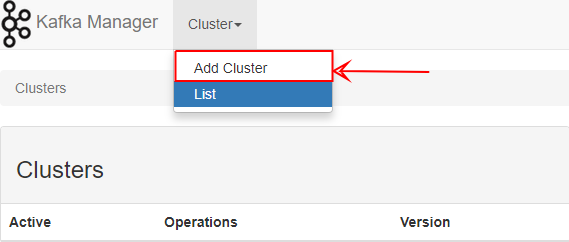
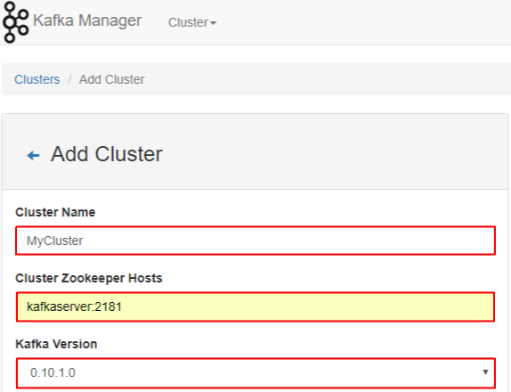
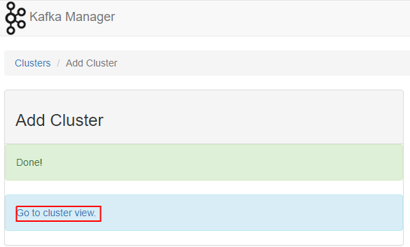
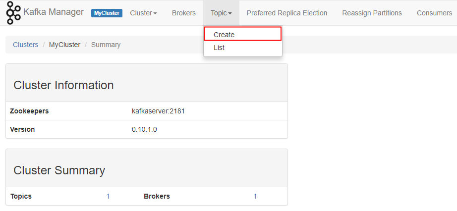

## Quick Start:
- Start Kafka
    - **Option 1:** Follow quick start
    - **Option 2:** After install docker, cd inside this folder, and write `docker-compose up`
        + In your browser write `localhost:9000`
        + **Create a broker**
            * 
        + **Change only the sections bellow then screw down and finally press `save`**
            * 
        + **Select  `Go to cluster view`**
            * 
        + **Crete a topic** 
            * 
        + **Type a topic and press enter** 
            * img src="./Images/SettingTopic.png" width="600 px" height="400 px"/>
        + **Go inside of the folder Example1 in this directory and run `main.py`**
             
## Installation Steps:
- Install `RASPBIAN STRETCH LITE`
    + [Link](https://www.raspberrypi.org/downloads/raspbian/)
- **first time that you log in typpe this user name and password.**
    + **raspberrypi login:** pi
    + **Password:** raspberry
- **Install python:**
    + `$ apt-get update`
    + `$ sudo apt-get install python3-picamera`
- **Install PIP:**
    + `$ sudo apt-get install python-pip`
- **Install python control librery.**
    + **With python packages manager:**
        * $ sudo pip install RPi.GPIO
            - [Link](https://raspberrypi.stackexchange.com/questions/8220/how-to-correctly-install-the-python-rpi-gpio-library)
- **Install git in debein:**
    + ` $ sudo apt-get install git-core`
         * [Link](https://www.digitalocean.com/community/tutorials/how-to-install-git-on-debian-8)
- **Intall python-kafka:**
    + ` $ pip install kafka-python` 
- Set up wifi
    + Change the file in `"/etc/network/interfaces.d"` with.
            
            auto lo
 
            iface lo inet loopback
            iface eth0 inet manual
    
            allow-hotplug wlan0
            auto wlan0
 
 
            iface wlan0 inet manual
                wpa-ssid "DC"
                wpa-psk "5124223639"

                
- Conect remotly to raspberry pi with IP addres.
    + Connect with GitBash
        * Open Git Bahs
        * Type
            - `ssh <userName>@<IP>` (i.e: ssh pi@10.0.0.116)
    + Connect with putty (with or withough GUI)
        * Install putty:
            - Link: https://www.chiark.greenend.org.uk/~sgtatham/putty/latest.html
        * Enable SSH inside of the raspberry pi:
            - `$ sudo raspi-config`
            - Select `Interfacing Options`
            - Navigate to and select `SSH`
            - Choose `Yes`
            - Select `Ok`
        * Get rasberry IP address
        * place this IP addres inside of putty and then press yes.
        * You need to introduce password and Username 

    + This option if you have a GUI install.
        * Get the IP address of the raspberry pi
        * Install VNC
            - Link: https://www.realvnc.com/en/connect/download/viewer/
        * Then run
            - `$ sudo apt-get update`
            - `$ sudo apt-get install realvnc-vnc-server realvnc-vnc-viewer`
            - sudo raspi-config
                + enable VNC Server by doing the following:
                    * Navigate to Interfacing Options.
                    * Scroll down and select VNC > Yes.
    + If you only want to control the 

## Importan commands and information:
- **Shoutdown Raspberry:**
    + `$ sudo shutdown -h now`
- **Reboot Raspberry:**
    + `$ sudo reboot -h now`
- **Git IP address:**
    + `$ hostname -I`
- **change Raspberry pi configurations:**
    + `$ sudo raspi-config`
- **Pi information:**
    + **UserName:** deepcast || pi  (deepcast doesn't have sudo power, `why?`) 
    + **Passwor:** ai
    + **IP addres:** 10.0.0.116
- **List all the availables port in windows:**
    + `$ netstat -aon | find /i "listening"`
- **List IP in Rasbian:** 
    + `$ sudo arp-scan -l --interface=wlan0`
- **List IP in Rasbian:** 
    + `$ netstat -pln`

## Investigate
- How do I give sudo power to deepcast?
- How do I access Raspberry pi with IP address?
- How do I set an IP address?
    + /etc/hostname
        * [link](https://www.raspberrypi.org/documentation/remote-access/ip-address.md)
## Important link:
- **Interesting tutorial:** [Link](https://learn.sparkfun.com/tutorials/raspberry-gpio)
- **Setting Raspberry py with ubuntu:** [Link](https://developer.ubuntu.com/core/get-started/installation-medias)
    + **Note:** after unpackages change ".img" for ".iso"
        * **Note:** in windows unable "file name extentions" to be able to see the extentions.

